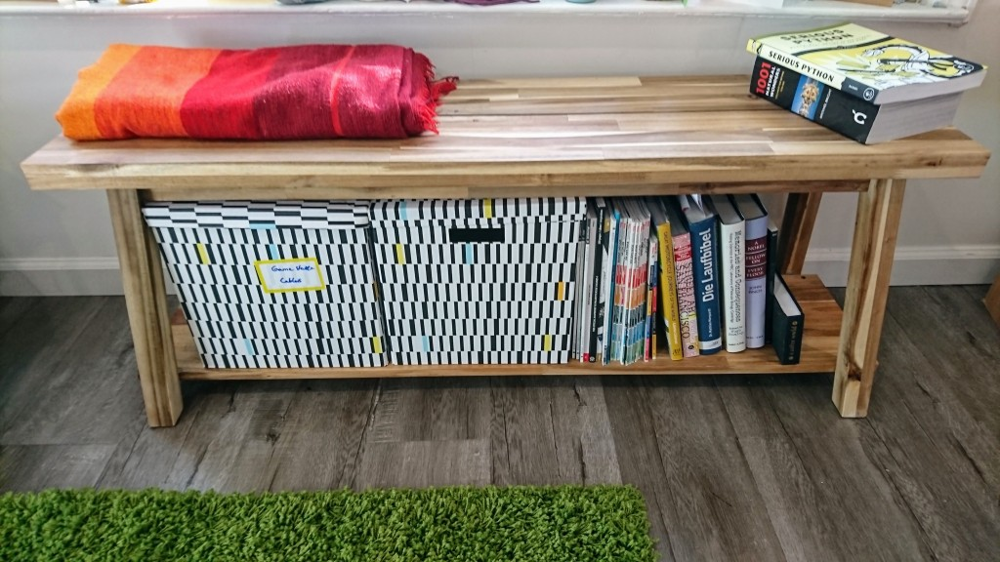
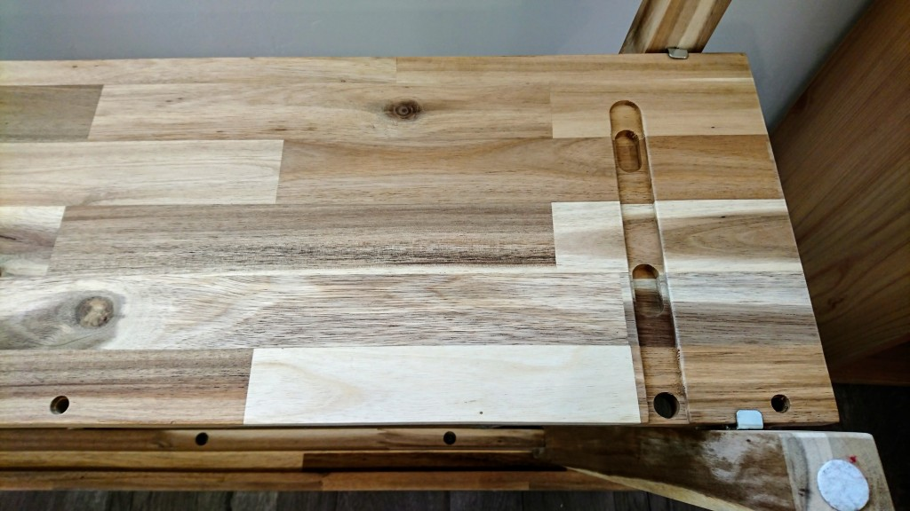
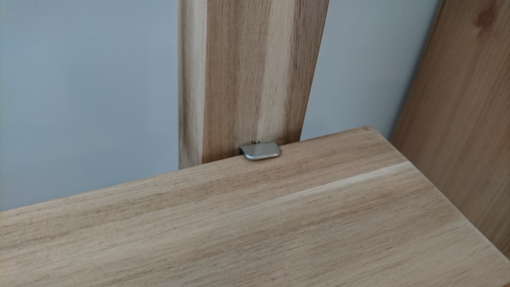
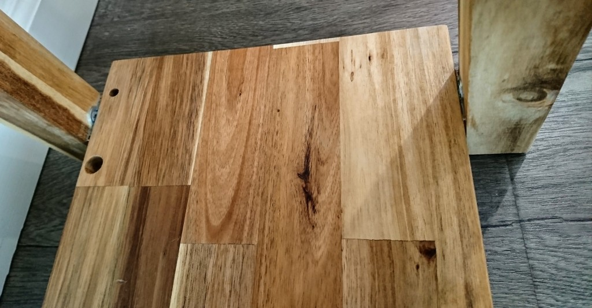
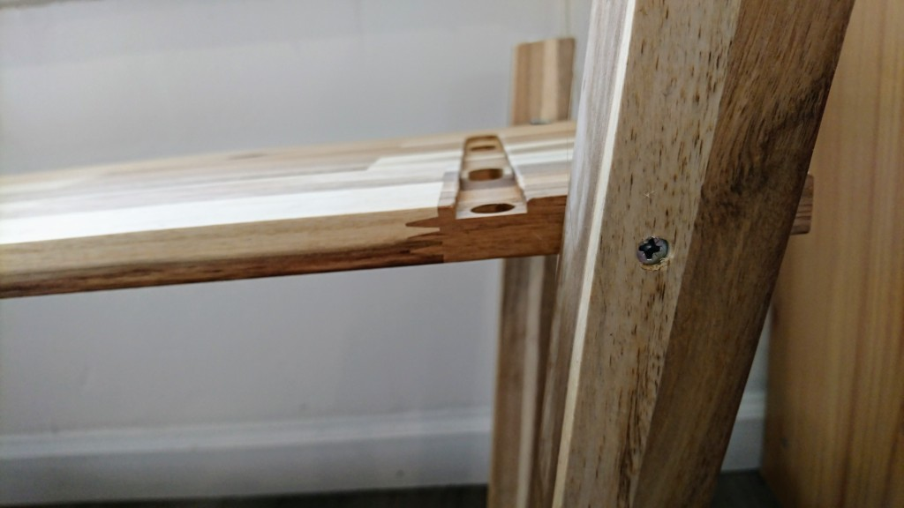
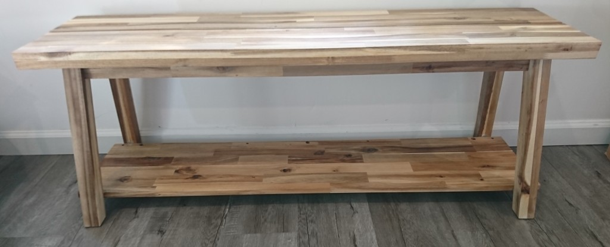

### SKOGSTA Bench with extra storage

This project is fairly quick and doesn't require woodworking skills (when using the longer SKOGSTA bench). It converts a SKOGSTA bench and (part of) a SKOGSTA wall shelf into a bench with extra storage. Useful as a shelf, cabinet or TV stand.  

Requires:
- SKOGSTA bench (47 1/4")
- SKOGSTA wall shelf (47 1/4")
- 4 small L-brackets
- various wood screws
- electric drill
- maybe some glue

This is the finished product:

## Mount the L-brackets

Forgot to take pictures here, sorry. Decide how high the shelf board should go, and measure the distance from the underside of the bench top. We went with 35.5cm, as this would allow fitting standard storage boxes and reasonable large books in there. Conveniently, at this height one of the two wall shelf boards has the exactly right width to fit in there. Coincidence? Maybe. Use short wood screws to mount the brackets, make sure they are at the same level on all four legs. 

## Fix the shelf board

Place the shelf board on the L brackets, make sure it's symmetric (aka 'flush with the ends of the bench').

If your L-brackets have holes, feel free to drill/screw through them into the board. The ones we had available unfortunately hadn't, and were a bit whimpy. Putting for screws into them horizontally through the legs fixed that problem. Obviously we pre-drilled holes to prevent the legs from splitting. 

Done. Congratulations!

